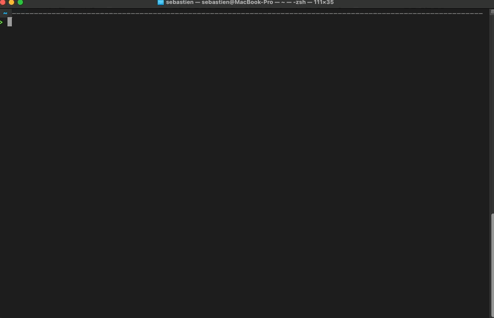

# omon

[](https://pypi.org/project/omon/)
[](https://www.python.org/downloads/)
[](LICENSE)
[](pyproject.toml)

**Ollama tells you names. omon tells you what they mean.**

[Ollama](https://ollama.com)'s CLI shows model tags and file sizes. `omon` decodes those tags, benchmarks performance on your hardware, tracks what's eating your RAM, and tells you what to run — or remove.



## Why omon?

- **Decode cryptic model names** — `35b-a3b-coding-nvfp4` becomes "Qwen3.5 · 35B (3B active) · Code generation · NVIDIA FP4 · vision, thinking, tools"
- **Benchmark on your machine** — cold/warm load times, tok/s, memory footprint; compare models side-by-side
- **Know what to run** — hardware-aware suggestions, successor alerts, cleanup recommendations for stale models
- **Local-first, zero dependencies** — Python stdlib only. No venv conflicts, no supply chain risk, no cloud calls

## Install

```bash
pipx install omon
```

Or from source:

```bash
pipx install git+https://github.com/LightbridgeLab/OllamaMon.git
```

Requires Python 3.10+ and a running Ollama instance.

## Quick start

```bash
omon                          # status overview: server, models, RAM, pressure
omon list                     # decoded model inventory
omon bench llama3.2:3b        # benchmark load time and tok/s
omon watch                    # live TUI (press q to quit)
```

More commands: `omon hw`, `omon suggest --task coding`, `omon cleanup`, `omon serve`.

## Documentation

- [Command reference](REFERENCE.md) — full docs for every command, config, and completions
- [Design history](PLANNING.md) — how and why omon was built
- [Roadmap](ROADMAP.md) — what's planned next
- [Security](SECURITY.md) — network exposure and data storage
- [Contributing](AGENTS.md) — architecture rules and conventions

## Requirements

- Python 3.10+
- [Ollama](https://ollama.com) running locally (or `--host` for remote)
- macOS or Linux (Apple Silicon is the primary target)

## License

MIT — see [LICENSE](LICENSE).
